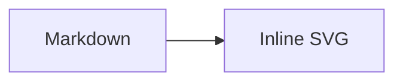

# Codeholics Astro Site

The Astro implementation of the Codeholics site.

## 🚀 Project Structure

Inside of your Astro project, you'll see the following folders and files:

```text
/
├── public/
│   └── favicon.svg
├── src
│   ├── assets
│   │   └── astro.svg
│   ├── components
│   │   └── Welcome.astro
│   ├── layouts
│   │   └── Layout.astro
│   └── pages
│       └── index.astro
└── package.json
```

To learn more about the folder structure of an Astro project, refer to [our guide on project structure](https://docs.astro.build/en/basics/project-structure/).

## Setup

Install the project dependencies and Chromium, which renders Mermaid diagrams during static builds:

```sh
npm install
npx playwright install chromium
```

## Mermaid Diagrams

Write Mermaid diagrams in post Markdown or MDX using a `mermaid` fenced code block:

````md

````

The diagram is rendered to inline SVG when the site builds. Run `npx playwright install chromium` before `npm run build` in every clean environment.

## GitHub Markdown Alerts

Post Markdown and MDX support GitHub-style alerts. Use one of the five supported
markers at the beginning of a blockquote:

```md
> [!NOTE]
> Useful information readers should know.

> [!TIP]
> Helpful advice for completing a task.

> [!IMPORTANT]
> Key information required to achieve a goal.

> [!WARNING]
> Urgent information that needs attention to avoid a problem.

> [!CAUTION]
> Information about risks or negative outcomes.
```

Alert markers are case-insensitive. Ordinary blockquotes and unsupported markers,
such as `> [!CUSTOM]`, remain ordinary quotations and do not fail the build.

## Emoji Shortcodes

Post Markdown and MDX support recognized GitHub-style gemoji shortcodes in
prose:

```md
Deploying now :rocket:

Celebrating the release :tada:
```

Recognized aliases render as their Unicode emoji equivalents. Unknown aliases
remain literal, as do aliases inside inline and fenced code:

````md
:not-an-emoji:

`:rocket:`

```text
:rocket:
```
````

## Post Images

Store post images under `public/images/posts/` and reference them with
root-relative URLs so they work from every generated route. To add an optional
post-card thumbnail, set `thumbnail` in the post frontmatter:

```md
---
thumbnail: /images/posts/my-post/card-image.webp
---
```

Use standard Markdown image syntax to render an image in the post body. Always
provide descriptive alternative text:

```md

```

Image URLs must use forward slashes and match the exact capitalization of the
asset path (`posts`, not `Posts`); production hosting is case-sensitive even
when a local Windows filesystem is not. Commit new image files along with the
Markdown changes so deployment includes them.

For thumbnail, post, and fullsize variants, use the thumbnail in frontmatter and
the post-sized image in the body. To optionally link it to the fullsize image:

```md
[](/images/posts/my-post/image_fullsize.webp)
```

## Social Sharing Previews

The initial HTML includes Open Graph metadata for Facebook and other link
previews, plus matching Twitter large-image cards. Post previews use the post's
`title`, its `summary` (or a plain-text body excerpt when blank/missing), and its
optional `thumbnail`. Thumbnail selection does not change post cards or body
images.

The homepage and posts without a nonempty thumbnail use
[`public/assets/og-default.png`](./public/assets/og-default.png), a 1200x630 PNG
derived from the supplied
[`Codeholics-Hero.webp`](./public/images/Codeholics-Hero.webp) artwork.
Other pages retain descriptive Codeholics defaults. Only the known fallback
image advertises its dimensions; arbitrary thumbnails are not labeled 1200x630.

Use 1200x630 artwork for predictable wide share previews. Image URLs must be
publicly accessible without authentication and served with an image content
type. Local paths become absolute URLs using the configured canonical site
URL; absolute HTTPS thumbnail URLs retain their external host. Prefer forward
slashes when authoring image URLs (legacy backslashes are normalized for social
metadata).

Canonical links and `og:url` identify each page, not just the homepage. The
default canonical host is `https://www.codeholics.com`; build-time `SITE_URL`
overrides also apply to local social image URLs. Local preview still uses the
deployment host in metadata, rather than localhost or a development asset host.

Validate changes from `astro/`:

```sh
npm run test:social-sharing
npm run test:e2e -- tests/social-sharing.spec.ts
npm run test:site-url
```

The fixture test temporarily adds uniquely named test posts, removes them in a
`finally` block, and removes their generated routes. Run `npm run build` afterward
to leave a clean production build. Do not deploy fixture-test output.

After deploying, check the actual page source and request its `og:image` URL.
For the initial deployment, inspect:

- Homepage: `https://www.codeholics.com/`
- Default image: `https://www.codeholics.com/assets/og-default.png`
- Post: `https://www.codeholics.com/posts/the-death-of-the-self-taught-hacker/`
- Post image: `https://www.codeholics.com/images/posts/the-death-of-the-self-taught-hacker/the_hacker_and_the_server_fortress_thumbnail.webp`

Then enter the shared page URL in
[Facebook Sharing Debugger](https://developers.facebook.com/tools/debug/) and
request **Scrape Again**. These are deployment checks, not proof that a local
test has updated the live site. Facebook controls rendering and caching;
re-scraping does not guarantee that already published shares update.

## Commands

All commands are run from the root of the project, from a terminal:

| Command                   | Action                                           |
| :------------------------ | :----------------------------------------------- |
| `npm install`             | Installs dependencies                            |
| `npm run dev`             | Starts local dev server at `localhost:4321`      |
| `npm run build`           | Build your production site to `./dist/`          |
| `npm run preview`         | Preview your build locally, before deploying     |
| `npm run lint:post-metadata` | Run warning-only metadata checks for Astro posts |
| `npm run ai:post:finalize` | Run AI-assisted metadata checks (warning-only)    |
| `npm run test:github-markdown-alerts` | Build and verify Markdown and MDX GitHub alert output |
| `npm run test:emoji-shortcodes` | Build and verify Markdown and MDX emoji shortcode output |
| `npm run test:social-sharing` | Build fixtures and verify crawler-readable post metadata |
| `npm run test:site-url` | Verify default/overridden canonical, social image, and RSS URLs |
| `npm run astro ...`       | Run CLI commands like `astro add`, `astro check` |
| `npm run astro -- --help` | Get help using the Astro CLI                     |

## 👀 Want to learn more?

Feel free to check [our documentation](https://docs.astro.build) or jump into our [Discord server](https://astro.build/chat).

## AI-assisted post metadata checks (warning-only)

When AI helps generate or edit a post, run:

```sh
npm run ai:post:finalize -- --file src/content/posts/<your-post>.md
```

For optional manual checks outside AI-assisted flow, run:

```sh
npm run lint:post-metadata -- --file src/content/posts/<your-post>.md
```

Required front matter keys for the check:
- `title`
- `date`
- `category`
- `tags`
- `slug`
- `summary`

The check is warning-only: it reports missing/empty required fields but does not fail publishing or build commands.
