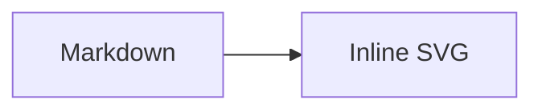

# Codeholics Astro Site

The Astro implementation of the Codeholics site.

## 🚀 Project Structure

Inside of your Astro project, you'll see the following folders and files:

```text
/
├── public/
│   └── favicon.svg
├── src
│   ├── assets
│   │   └── astro.svg
│   ├── components
│   │   └── Welcome.astro
│   ├── layouts
│   │   └── Layout.astro
│   └── pages
│       └── index.astro
└── package.json
```

To learn more about the folder structure of an Astro project, refer to [our guide on project structure](https://docs.astro.build/en/basics/project-structure/).

## Setup

Install the project dependencies and Chromium, which renders Mermaid diagrams during static builds:

```sh
npm install
npx playwright install chromium
```

## Mermaid Diagrams

Write Mermaid diagrams in post Markdown or MDX using a `mermaid` fenced code block:

````md

````

The diagram is rendered to inline SVG when the site builds. Run `npx playwright install chromium` before `npm run build` in every clean environment.

## GitHub Markdown Alerts

Post Markdown and MDX support GitHub-style alerts. Use one of the five supported
markers at the beginning of a blockquote:

```md
> [!NOTE]
> Useful information readers should know.

> [!TIP]
> Helpful advice for completing a task.

> [!IMPORTANT]
> Key information required to achieve a goal.

> [!WARNING]
> Urgent information that needs attention to avoid a problem.

> [!CAUTION]
> Information about risks or negative outcomes.
```

Alert markers are case-insensitive. Ordinary blockquotes and unsupported markers,
such as `> [!CUSTOM]`, remain ordinary quotations and do not fail the build.

## Emoji Shortcodes

Post Markdown and MDX support recognized GitHub-style gemoji shortcodes in
prose:

```md
Deploying now :rocket:

Celebrating the release :tada:
```

Recognized aliases render as their Unicode emoji equivalents. Unknown aliases
remain literal, as do aliases inside inline and fenced code:

````md
:not-an-emoji:

`:rocket:`

```text
:rocket:
```
````

## Commands

All commands are run from the root of the project, from a terminal:

| Command                   | Action                                           |
| :------------------------ | :----------------------------------------------- |
| `npm install`             | Installs dependencies                            |
| `npm run dev`             | Starts local dev server at `localhost:4321`      |
| `npm run build`           | Build your production site to `./dist/`          |
| `npm run preview`         | Preview your build locally, before deploying     |
| `npm run lint:post-metadata` | Run warning-only metadata checks for Astro posts |
| `npm run ai:post:finalize` | Run AI-assisted metadata checks (warning-only)    |
| `npm run test:github-markdown-alerts` | Build and verify Markdown and MDX GitHub alert output |
| `npm run test:emoji-shortcodes` | Build and verify Markdown and MDX emoji shortcode output |
| `npm run astro ...`       | Run CLI commands like `astro add`, `astro check` |
| `npm run astro -- --help` | Get help using the Astro CLI                     |

## 👀 Want to learn more?

Feel free to check [our documentation](https://docs.astro.build) or jump into our [Discord server](https://astro.build/chat).

## AI-assisted post metadata checks (warning-only)

When AI helps generate or edit a post, run:

```sh
npm run ai:post:finalize -- --file src/content/posts/<your-post>.md
```

For optional manual checks outside AI-assisted flow, run:

```sh
npm run lint:post-metadata -- --file src/content/posts/<your-post>.md
```

Required front matter keys for the check:
- `title`
- `date`
- `category`
- `tags`
- `slug`
- `summary`

The check is warning-only: it reports missing/empty required fields but does not fail publishing or build commands.
